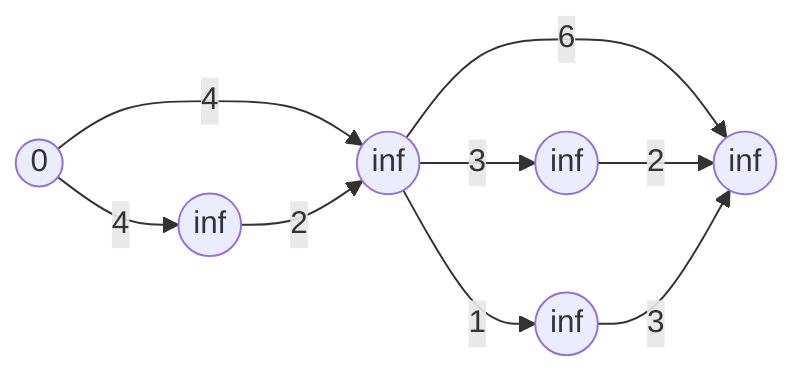
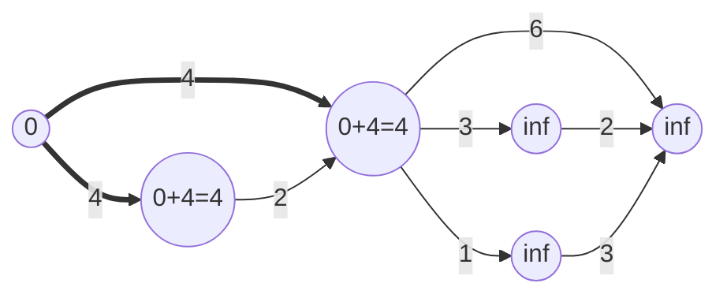
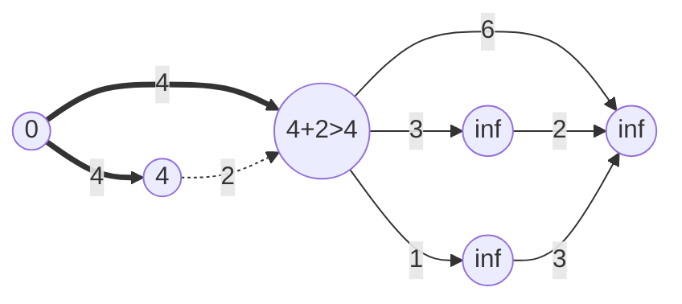
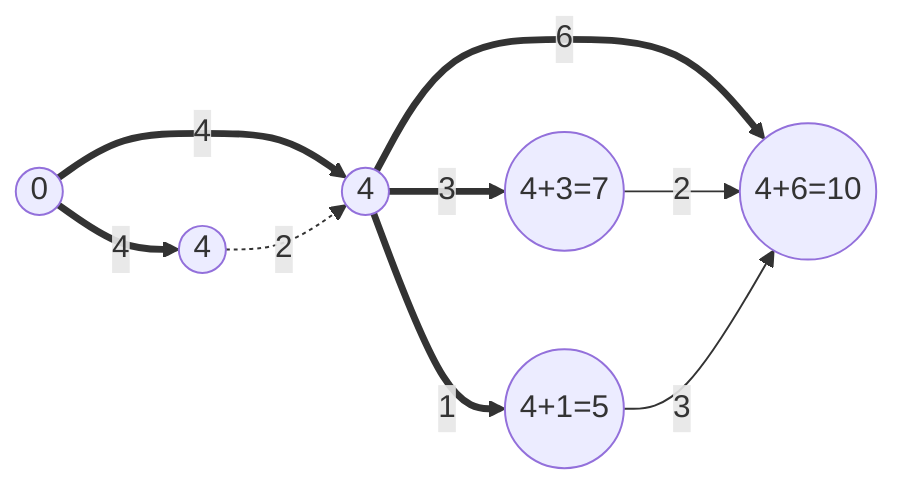
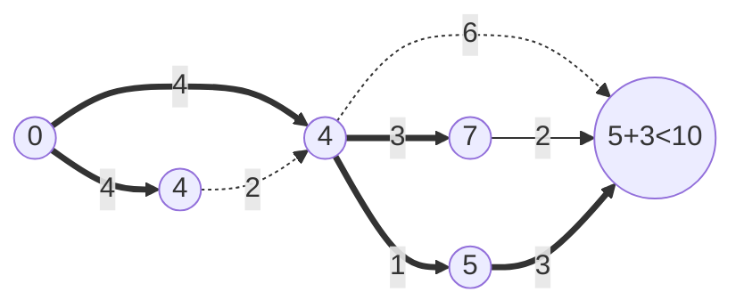
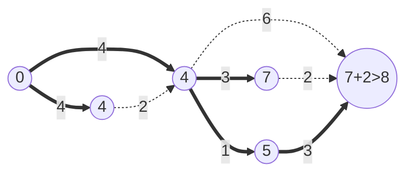
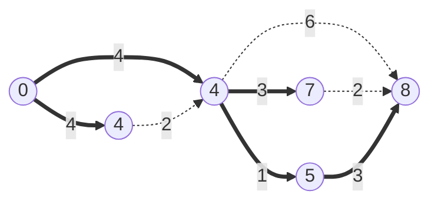

# Dijkstra's Algorithm

Dijkstra's algorithm allows us to find the shortest path between any two vertices of a graph

---

## Idea



---



---



---



---



---



---



---

## Pseudocode
Implementation of Dijkstra's Algorithm using Priority Queue:

```python
function dijkstra(Graph G, Start S):
    Priority Queue Q
    for each vertex V in G:
        distance[V] := infinity
        previous[V] := infinity
        if V != S then add V to Q

    while Q is not empty:
        U := min(Q)
        for each unvisited neighbor V of U:
            temp_distance := distance[U] + edge_weight(U, V)
            if temp_distance < distance[V]:
                distance[V] := temp_distance
                previous[V] := U
    return distance[], previous[]
```

---

## Complexity:
Let $V$ be the number of vertices:
1. Naive Implementation
    - $O(V^2)$
    - $\Omega(V^2)$
    - $\Theta(V^2)$
2. Binary Heap + Priority Queue
    - $O(E\log V)$
    - $\Omega(E\log V)$
    - $\Theta(E\log V)$
3. Fibonacci Heap + Priority Queue
    - WTF?

## References:
()[https://iq.opengenus.org/time-and-space-complexity-of-dijkstra-algorithm/]
()[https://www.programiz.com/dsa/dijkstra-algorithm]
